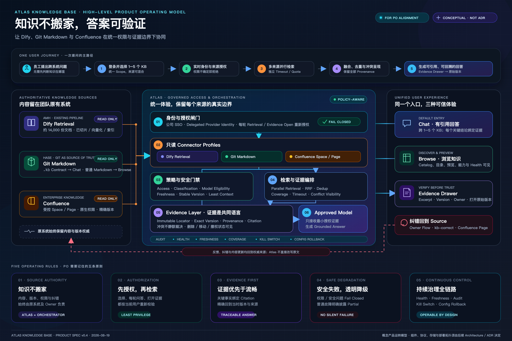

# Atlas Knowledge Base

Evidence-first, permission-aware access to enterprise knowledge across Dify,
Git Markdown, and Confluence.

> **Project status:** product discovery and specification-driven design. The
> current product decision baseline is v0.4; this repository does not yet claim
> an accepted implementation architecture or production-ready runtime.



## Overview

Atlas Knowledge Base gives employees one governed entry point for finding,
browsing, and asking questions across knowledge that already lives in different
team systems.

Atlas is an access and orchestration layer, not another content migration
platform:

- source systems remain authoritative for content, versions, permissions, and
  corrections;
- existing ingestion, Markdown conversion, embedding, and vectorization
  pipelines remain owned by their teams;
- Atlas performs current-user authorization, read-only retrieval, policy
  checks, evidence fusion, citation, health reporting, and audit;
- approved models receive only the minimum currently authorized evidence needed
  to produce a grounded answer.

## Source Profiles

| Source profile | Existing operating model | Atlas capability |
|---|---|---|
| Dify Retrieval | An external team pipeline owns ingestion, chunking, embedding, and vector indexing | Governed retrieval and exact evidence mapping after validation gates |
| Git Markdown | Teams manage Markdown and version history in Git | `.kb` Contract repositories can become Chat-ready; ordinary Markdown remains Browse-only |
| Confluence | Spaces and pages remain managed through existing Confluence workflows | Scoped page discovery, read-only retrieval, native access checks, and version-aware evidence |

## User Experience

The target journey is:

```text
Company SSO
  → select 1–5 logical knowledge bases
  → re-authorize every source for the current user
  → retrieve from eligible sources in parallel
  → fuse and de-duplicate evidence while preserving provenance
  → generate a grounded answer with citations
  → inspect the Evidence Drawer
  → open the exact authorized source version
```

Atlas exposes three complementary experiences:

- **Chat** — grounded answers across selected Chat-ready knowledge bases;
- **Browse** — catalog, hierarchy, preview, capability, and source-health views;
- **Evidence** — exact excerpts, source identity, version, owner, timestamps,
  and re-authorized navigation to the original system.

## Product Principles

1. **Evidence first** — every material factual claim must be traceable.
2. **Source-agnostic experience, source-specific truth** — the interface is
   unified without erasing provider-specific authority or version semantics.
3. **Authorize before retrieval** — uncertain identity, permission,
   classification, model eligibility, or evidence version fails closed.
4. **No silent partial answers or conflict resolution** — degraded coverage and
   competing source claims remain visible.
5. **Continuous governance** — health, freshness, coverage, audit, kill switches,
   and configuration rollback apply across the journey.

## Start Here

| Artifact | Purpose |
|---|---|
| [Product specification v0.4](docs/product/atlas-knowledge-base-product-spec-v0.4-cn.md) | Current multi-source product decision baseline |
| [High-level operating model](docs/product/diagrams/atlas-knowledge-operating-model-v0.4/README.md) | PO-facing poster, editable SVG, and presentation notes |
| [Interactive v0.4 prototype](docs/product/prototypes/atlas_knowledge_base_v0_4_multi_source_mvp.html) | Current product and interaction exploration |
| [Grill Mode decision record](docs/product/grill-decisions-v0.4-2026-08-19.md) | Decision provenance for the v0.4 extension |
| [Product-spec review](docs/reviews/product-spec-v0.4-review.md) | Quality review and known limitations |
| [SDD bootstrap guide](docs/SDD-BOOTSTRAP.md) | Required artifact chain and quality gates |

To inspect the prototype locally on macOS:

```bash
open docs/product/prototypes/atlas_knowledge_base_v0_4_multi_source_mvp.html
```

## Repository Structure

```text
.agents/skills/                 Locked project-local SDD skill mirror
docs/00-context/                Constitution, profile, registry, and traceability context
docs/01-requirements/           Slice requirements
docs/02-user-stories/           User stories and acceptance criteria
docs/03-spec/                   Accepted implementation-facing specifications
docs/04-architecture/           Architecture, data flow, and data model artifacts
docs/05-design/                 Detailed design and cross-boundary contracts
docs/06-tasks/                  Ordered implementation tasks
docs/architecture/decisions/    Architecture Decision Records
docs/product/                   Product baselines, decisions, prototypes, and diagrams
docs/reviews/                   Document quality and readiness reviews
scripts/                        Repository verification utilities
backend/                        Spring Boot 3.4 / JDK 21 modular monolith
frontend/                       Vue 3 + TypeScript + Vite SPA
```

Local backend skeleton (JDK 21, Maven Wrapper):

```bash
./mvnw -q test
./mvnw spring-boot:run
```

Health is Actuator-only (`GET /actuator/health`). Business `/api/v1` endpoints
are not part of TASK-001.

Environment planes (TASK-003; default `local`):

```bash
./mvnw spring-boot:run -Dspring-boot.run.profiles=local
# non-prod / prod need ATLAS_DATASOURCE_* from the environment (Oracle 19c).
# H2 is rejected on non-prod and prod.
```

Shared Flyway history (TASK-004). Local H2 is migrated on application start.
Oracle migrate (required before treating schema as accepted):

```bash
./scripts/flyway-migrate-oracle.sh
```

Local frontend skeleton:

```bash
cd frontend
npm install
npm test
npm run build
npm run dev
```

Route placeholders: `/chat` (default landing), `/kbs`, `/settings`. The SPA
talks only to Atlas APIs (Vite proxies `/api` to `http://127.0.0.1:8080`).
Do not store provider tokens in browser storage.

## SDD Workflow

Non-trivial or user-visible changes follow the repository's requirements → user
stories → specification → architecture → design → tasks chain before
implementation.

Before contributing, read these files in order:

1. [`AGENTS.md`](AGENTS.md)
2. [`PROJECT_RULES.md`](PROJECT_RULES.md)
3. [`docs/00-context/constitution.md`](docs/00-context/constitution.md)
4. [`docs/00-context/sdd-profile.md`](docs/00-context/sdd-profile.md)
5. [`docs/SDD-BOOTSTRAP.md`](docs/SDD-BOOTSTRAP.md)

When mirrored skills or their lock file change, run:

```bash
./scripts/verify-sdd-skills.sh
```

## Current Design Boundary

The product baseline defines behavior and responsibility boundaries. Concrete
components, protocols, schemas, persistence, provider credential storage,
deployment topology, retrieval fusion details, evidence-cache isolation, and
historical revocation behavior require Architecture Spikes and accepted ADRs.

The `mvp` requirements document is rebased to this v0.4 baseline. User stories
and later SDD stages still need to be generated from that rebased artifact after
its quality review and product-owner acceptance. Connector Architecture Spikes
and ADRs remain blockers for architecture acceptance and implementation.
