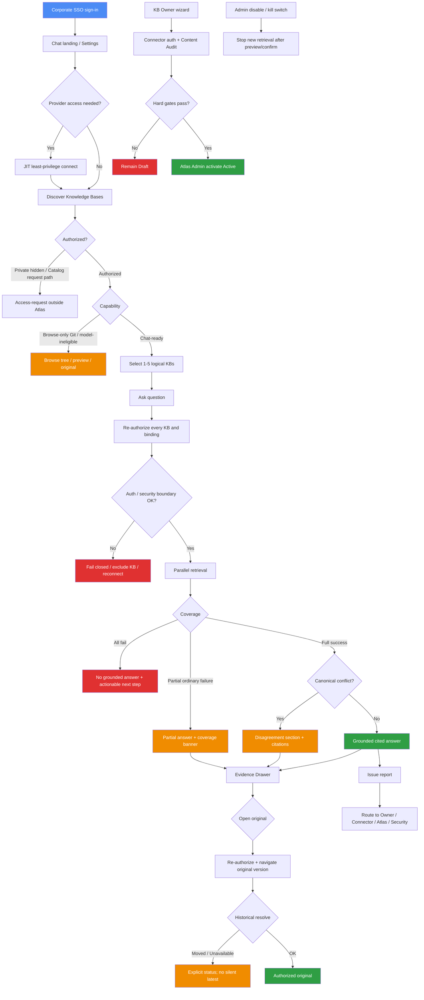

# Feature Specification: Atlas Knowledge Base MVP

> **Source stories:** US-001, US-002, US-003, US-004, US-005, US-006, US-007
> **Upstream requirements:** `docs/01-requirements/mvp-requirements.md`
> **Product baseline:** `docs/product/atlas-knowledge-base-product-spec-v0.4-cn.md`
> **Spec status:** Accepted
> **Last updated:** 2026-08-21
> **Accepted:** 2026-08-20
> **Slice:** `mvp`

`[USER-STATED]` On 2026-08-20 the product owner accepted
`docs/02-user-stories/mvp-user-stories.md` as the MVP user-story baseline. This
specification consolidates that accepted set.

`[USER-STATED]` On 2026-08-20 the product owner accepted this specification as
the MVP behavior baseline after `review-doc-quality` reported Ready with minor
fixes and no Critical or Major findings.

`[USER-STATED]` On 2026-08-21 the product owner accepted ADR-0007: grounded
generation uses the per-user local SME Go gateway; Chat remains in Atlas;
Copilot credentials do not enter Atlas. FR-03, FR-04, FR-07, FR-39, FR-53, and
FR-72–FR-79 record that amendment. `/api/v1` field names are unchanged in this
revision.

`[USER-STATED]` Ordinary GitHub Markdown repositories remain Browse-only in MVP.
Chat requires a team-generated, validated `.kb` contract. Atlas does not
auto-bootstrap an index contract.

TASK-001–010 are already on `main`. This amendment does not change runtime
code. Provider and model capabilities remain spike-gated until real-environment
evidence exists.

---

## Overview

**Feature summary:**
Atlas Knowledge Base MVP gives internal technical users one governed place to
discover, browse, and ask grounded questions across authorized knowledge that
already lives in Dify, Git Markdown, and Confluence, and to verify every
material factual claim against currently authorized original evidence.

**Business objective:**
Shorten the path from a cross-system technical question to a verifiable answer
without forcing teams onto one ingestion pipeline, without Atlas owning source
content, and without weakening source-system permissions or provenance.

**In-scope outcome:**
Authenticated users can complete Chat, Browse, Evidence, Registration,
failure/governance, and issue-routing journeys for activated Source Profiles
that pass their gates; every key factual claim is citable to a stable
authorized version; and the system fails closed on permission, coverage,
conflict, revocation, and security boundaries.

---

## Source Stories

| Story | Title / Summary | Key Capability |
|-------|----------------|----------------|
| US-001 | Sign in, keep a private session, and connect providers | SSO session, Settings, JIT least-privilege provider connect, token boundary |
| US-002 | Discover and browse authorized knowledge bases | Catalog, Browse-only Git, Chat-ready selection, access-request routing |
| US-003 | Register, validate, and activate a knowledge base | Owner wizard, binding gates, Admin activation, no hard-gate override |
| US-004 | Ask grounded questions across selected knowledge bases | 1–5 logical KB Chat, re-auth retrieval, citations, performance targets |
| US-005 | Inspect evidence and open the original version | Evidence Drawer, locators, re-auth original navigation, Moved/Unavailable |
| US-006 | Handle coverage, conflicts, revocation, and governance | Partial coverage, fail-closed, conflict display, kill switch / disable |
| US-007 | Report issues to the accountable owner or source workflow | Issue classification, content-free diagnostics, source-owned correction |

---

## Actors / Users

**Primary actors** (directly interact with or trigger the system):
- **End User:** Internal technical user who signs in, browses, chats, inspects evidence, and reports issues
- **KB Owner:** Verified owner who registers Draft knowledge bases and owns content accountability
- **Atlas Admin:** Activates passing knowledge bases and operates disable, kill switch, retire, and rollback
- **Connector Owner:** Completes source authorization and receives connector-incident routing

**Supporting actors** (indirectly involved or upstream/downstream):
- **Corporate SSO / IAM:** Authoritative employee identity and employment status
- **Source systems (Dify, GitHub Enterprise, Confluence):** Authoritative content, versions, permissions, and corrections
- **Enterprise model channel:** Approved Copilot generation via the user's local SME Go gateway (ADR-0007), subject to live registration and the model-channel spike
- **Company security process:** Classification approval and security-incident intake
- **Existing correction workflows:** HASE `kb-correct` / contribution flow; Confluence page workflow; Dify Owner remediation

---

## Functional Scope

**Core capability domains:**
- **Identity, session, and provider connection:** SSO sign-in, private session, Settings, JIT provider authorization
- **Discovery and Browse:** Catalog, detail, Browse-only Git, Chat-ready entry
- **Registration and activation:** Wizard, Content Audit, hard gates, lifecycle and health
- **Grounded Chat:** Scope selection, retrieval, fusion ranking constraint, cited answers
- **Evidence and original navigation:** Drawer, locators, historical resolution
- **Failure, conflict, and governance:** Coverage, conflicts, revocation, disable / kill switch
- **Issue routing and security containment:** Reports, correction routing, untrusted-content handling
- **Cross-cutting system constraints:** Classification, model-send auth, cache isolation, accessibility, evaluation, pilot

**Lifecycle stages:**
1. Sign in and connect providers
2. Discover and browse authorized knowledge bases
3. Register, validate, and activate knowledge bases (Owner / Connector / Admin)
4. Select Chat-ready scope and ask grounded questions
5. Inspect evidence and open originals
6. Handle partial failure, conflict, revocation, and governance controls
7. Report issues to the accountable owner or process

**Workflow boundaries:**
- Entry point: Corporate SSO authentication into Atlas
- Exit point: Completed grounded answer with evidence; Browse-only inspection; activated knowledge base; or explicit fail-closed / Suspended / Retired terminal governance state
- Out-of-band transitions: Provider reconnect, safe retry, cancel generation, access-request routing, disable / kill switch, rollback requiring re-validation, spike-gate suspension of a Source Profile

---

## Functional Requirements

> Requirements marked `[INFERRED]` are not explicitly stated in source stories but are logically
> required. Confirm with the product owner before treating as committed scope.
>
> Stable upstream `REQ-*` IDs are preserved in parentheses for traceability. Spec `FR-*` IDs are
> the behavior IDs for this document.

### Identity, Session, And Provider Connection

- **FR-01**: The system shall authenticate users through corporate SSO and use only that identity for the Atlas session. *(Source: US-001; REQ-AUTH-001)*
- **FR-02**: Chat shall be the default authenticated landing experience. *(Source: US-001; REQ-CHAT-001)*
- **FR-03**: Model authorization shall be separate from Atlas identity and knowledge-base authorization. A shared model credential shall not bypass per-user entitlement. Copilot credentials shall remain on the user's local SME gateway and shall not be stored by Atlas (ADR-0007). *(Source: US-001; REQ-AUTH-002, REQ-AUTH-003; ADR-0007)*
- **FR-04**: Settings shall show corporate identity session, local-gateway online/offline as model-channel eligibility, and GitHub/Confluence connection state, granted scope, expiry, and last verified time. Settings shall not add a Copilot account-binding page. Gateway online/offline detail is visible only to that user. Existing `GET /settings` field `model_channel.eligible` keeps its name; its meaning is this live-registration state. *(Source: US-001; REQ-SET-001; ADR-0007)*
- **FR-05**: Provider authorization shall start just-in-time on first selection, use least privilege per provider, and shall not silently expand scope later. *(Source: US-001; REQ-CRED-005, REQ-CRED-006)*
- **FR-06**: GitHub and Confluence access shall prefer delegated current-user identity. When a provider cannot supply user-level authorization, only an auditable, revocable, KB Owner-approved SSO group mapping is allowed. *(Source: US-001; REQ-AUTH-013, REQ-AUTH-009)*
- **FR-07**: The browser shall hold only an opaque Atlas session. Provider tokens shall not be written to Local Storage, Session Storage, URL, logs, or analytics. GitHub and Confluence provider credentials shall remain in an encrypted server-side approved secret boundary. Copilot credentials shall not enter that boundary (ADR-0007). The concrete secret-manager product requires an ADR. *(Source: US-001; REQ-CRED-001, REQ-CRED-002; ADR-0006, ADR-0007)*
- **FR-08**: The Atlas session shall use a short-lived `__Host-`, Secure, HttpOnly, SameSite cookie with idle and absolute expiry and CSRF protection. Exact idle and absolute lifetimes remain an open Security approval item. *(Source: US-001; REQ-CRED-003)*
- **FR-09**: Expired source authorization shall preserve allowed non-sensitive name and Owner metadata, disable retrieval, and prompt reconnect. *(Source: US-001; REQ-CRED-007)*
- **FR-10**: Token leakage, revocation, or compromise shall revoke provider tokens, terminate related Atlas sessions, set affected bindings to reconnect-required, and write content-free security audit events. *(Source: US-001 / review carry-forward; REQ-CRED-004)*
- **FR-11**: Chat history shall be private to its creating user. After sign-out, another user on the same browser profile shall not see prior private history. *(Source: US-001; REQ-CHAT-006)*
- **FR-12**: Chat history shall default to 90-day retention, remain policy-configurable, and support earlier user deletion. *(Source: US-001; REQ-DATA-002)*

### Discovery And Browse

- **FR-13**: Users shall see only knowledge bases they are authorized to discover. Ordinary UI copy shall use Knowledge Base and Source. *(Source: US-002; REQ-BROWSE-001, REQ-TERM-001)*
- **FR-14**: Catalog entries shall show name, description, source badges, Owner, Chat/Browse capability, lifecycle, health, freshness, Atlas verification time, and source-specific scale. Filters shall include provider, capability, lifecycle, health, Owner, and freshness. Catalog text search shall match logical metadata only. *(Source: US-002; REQ-BROWSE-002, REQ-BROWSE-007, REQ-BROWSE-008)*
- **FR-15**: `Private` knowledge bases shall be hidden from unauthorized users. `Catalog` entries may expose non-sensitive name, Owner, capability, and the official access-request path without Atlas granting access. *(Source: US-002; REQ-DISC-001, REQ-DISC-002, REQ-AUTH-008, REQ-BROWSE-005)*
- **FR-16**: A Git knowledge base without a validated `.kb` contract shall support authorized directory tree, Markdown preview, and original Git link only, and shall not allow Chat, summary, or cross-file search. Detecting `manifest.json` shall not auto-upgrade capability. *(Source: US-002, US-003; REQ-GIT-002, REQ-GIT-009, REQ-GIT-010)*
- **FR-17**: Browse-only and model-ineligible knowledge bases shall appear disabled in the Chat selector with a reason and shall not have content sent to a model. Retired knowledge bases shall not be selectable or participate in retrieval. *(Source: US-002; REQ-BROWSE-011, REQ-ELIG-002, REQ-KB-010)*
- **FR-18**: From an authorized Chat-ready knowledge-base detail page, a user shall be able to start a new chat with that knowledge base selected. *(Source: US-002; REQ-BROWSE-006)*
- **FR-19**: Multi-source counts shall display per source by default. The detail experience shall expose Overview, Sources, Content, Access, Health, and Audit Summary plus authorized preview and original navigation. Browse shall reuse source-provided folders, trees, labels, and tags when present and shall not require AI-generated topics. *(Source: US-002; REQ-BROWSE-003, REQ-BROWSE-004, REQ-BROWSE-009, REQ-BROWSE-010)*

### Registration And Activation

- **FR-20**: Only verified KB Owners shall create Drafts through a guided wizard with steps Basics, Sources, Access & Classification, Connection Test, Content Audit, and Review & Submit. Ordinary users shall not self-register datasets, repositories, or Spaces. The wizard is not a full administration console. Registration shall be versioned, schema-validated, reviewable, and auditable. *(Source: US-003; REQ-WIZ-001, REQ-WIZ-003, REQ-KB-001, REQ-KB-003, REQ-KB-004)*
- **FR-21**: Multiple sources may bind to one knowledge base only when they share one Owner, purpose, classification, model eligibility, and maximum access boundary; otherwise Atlas shall reject the combination. A configuration-level access-boundary, audience, or classification mismatch shall reject or suspend the knowledge base as permission drift; Atlas shall not silently return a narrower boundary. *(Source: US-003; REQ-BIND-001, REQ-BIND-004)*
- **FR-22**: Each binding shall have a stable `binding_id`, provider profile, source identity, role, authorization method, health, freshness policy, and evidence-locator rule. Binding roles shall be `canonical`, `mirror`, or `supplemental`. Each binding shall declare credential owner, purpose, and operating responsibility; the AMH vectorization service account shall not be reused by default. Incompatible region, retention, or egress constraints shall not activate together. Mixed model eligibility across bindings shall make the whole knowledge base Browse-only. *(Source: US-003; REQ-BIND-002, REQ-BIND-003, REQ-BIND-006, REQ-BIND-007, REQ-ELIG-001)*
- **FR-23**: A Git source without a validated `.kb` contract may activate as Browse-only and shall become Chat-ready only after schema, permission, citation, evaluation, and explicit Owner activation pass. The Git MVP provider target is the company's actual GitHub Enterprise deployment behind a provider-neutral adapter; GitLab, Bitbucket, and generic Git are not committed MVP providers. *(Source: US-003; REQ-GIT-001, REQ-GIT-003, REQ-GIT-010)*
- **FR-24**: Dify Chat submission shall run Content Audit showing total, Chat-eligible, excluded, exclusion reasons, last audited at, and a downloadable remediation list. Non-compliant documents shall never receive title-only or fabricated citations. A Dify dataset/binding shall have one uniform maximum access boundary; mixed-ACL datasets shall be split before activation. *(Source: US-003; REQ-DIFY-002, REQ-DIFY-003, REQ-DIFY-004, REQ-DIFY-005)*
- **FR-25**: First activation shall require every configured binding to pass authentication/minimum scope, retrieval and exact fetch, stable version/link resolution, permission boundary and model eligibility, citation completeness, deletion/move propagation, health/latency/quota/error taxonomy, and region/retention/egress/security gates. A binding lacking a stable original-version mapping shall not pass activation. Failed bindings keep the knowledge base in Draft. Admins shall not override security or evidence hard gates. Activation also requires business approval, technical validation, and any classification-required security approval. *(Source: US-003; REQ-KB-008, REQ-KB-015, REQ-SRC-004, REQ-WIZ-004)*
- **FR-26**: Connector Owners complete source authorization; Atlas Admins validate and activate; classification-required extra approval reuses the company security workflow. *(Source: US-003; REQ-WIZ-002)*
- **FR-27**: On activation, a knowledge base becomes Active with stable `logical_kb_id`, configuration version, and independent lifecycle and health values. Lifecycle states are Draft, Active, Suspended, Retired. Health states are Healthy, Degraded, Unavailable. Only Active knowledge bases are available to ordinary users; Chat retrieval uses only Active Chat-ready knowledge bases that pass current authorization, health, and model-eligibility rules. *(Source: US-003; REQ-KB-002, REQ-KB-005, REQ-KB-006, REQ-KB-011)*
- **FR-28**: A knowledge base without an accountable active Owner shall be Suspended until ownership is transferred. *(Source: US-003 / review carry-forward; REQ-KB-007)*
- **FR-29**: Atlas shall not own ingestion, conversion, embedding, or vectorization and shall not become the authoritative editor or full-document repository. Original source systems remain authoritative for content, versions, and item-level access. Dify reuses the AMH pipeline. Git Chat consumes a team-generated `.kb` contract. Confluence uses the company's actual deployment variant behind an extensible adapter and native user-context APIs inside an explicit Space; a second Cloud/Data Center variant is not a committed MVP provider. If Confluence cannot satisfy delegated authorization, exact version fetch, deletion propagation, or the citation gate, that profile remains Suspended. *(Source: US-003; REQ-PROF-001, REQ-PROF-002, REQ-LIFE-001, REQ-LIFE-002, REQ-DIFY-001, REQ-CONF-001, REQ-CONF-002, REQ-CONF-003, REQ-CONF-007)*

### Grounded Chat

- **FR-30**: A new chat shall restore the most recently used authorized Chat-ready selection when still valid, allow change before the first question, and require at least one and at most five logical knowledge bases. Bindings do not consume slots. A chat may mix Dify, Git Markdown, and Confluence logical knowledge bases within that limit when each is Chat-ready and currently authorized. Shared chat, public links, bulk export, and cross-user chat search are excluded. *(Source: US-004; REQ-CHAT-002, REQ-CHAT-003, REQ-CHAT-007, REQ-CHAT-010, REQ-BIND-005)*
- **FR-31**: Every user turn shall perform retrieval against the current authorized Chat-ready knowledge-base scope. Before each retrieval, Atlas shall re-authorize every selected knowledge base and each current-user binding. *(Source: US-004; REQ-RAG-001, REQ-AUTH-004)*
- **FR-32**: Answers shall use only current authorized, model-eligible, version-stable evidence. Each key factual claim shall have a citation. Atlas shall not add internet search, unmarked model general knowledge, or unselected knowledge-base content. When evidence is insufficient, the system shall state that condition and offer rephrasing or user-controlled knowledge-base-scope expansion. *(Source: US-004; REQ-RAG-004, REQ-RAG-005, REQ-RAG-006, REQ-RAG-009)*
- **FR-33**: Follow-up turns shall retrieve again. Prior AI answers are not factual evidence. *(Source: US-004; REQ-CHAT-011, REQ-RAG-002)*
- **FR-34**: For Git Chat-ready knowledge bases, retrieval shall search only configured Markdown/text roots and `.kb` indexes, read hit documents at a pinned commit, and shall not clone the whole repository. Code, issues, PRs, and releases are excluded. Webhooks or polling shall refresh Git manifest, tree, and metadata caches. *(Source: US-004; REQ-GIT-004, REQ-GIT-005, REQ-GIT-011)*
- **FR-35**: Changing knowledge-base selection after answers exist shall create a new chat or explicit branch rather than silently rewriting existing evidence boundaries. Each answer shall retain the exact scope, configuration version, and binding set used. *(Source: US-004; REQ-CHAT-004, REQ-CHAT-005)*
- **FR-36**: Retrievers shall return their own Top-K results in parallel. Fusion shall use Reciprocal Rank Fusion as a product ranking constraint; component choices require an ADR. Dedup may merge answer evidence but must preserve every retrieval provenance path. Raw retrieval scores shall not be shown to ordinary users. *(Source: US-004; REQ-RAG-003, REQ-RAG-013, REQ-RAG-014, REQ-RAG-015, REQ-SRC-008)*
- **FR-37**: Answer language shall default to the question language. Direct quotations keep the source language; translations are labeled. *(Source: US-004; REQ-RAG-007, REQ-RAG-008)*
- **FR-38**: Under the approved normal-load profile, the UI shall show an explicit processing state within 2 seconds, streamed output shall begin within 5 seconds, and completion shall be at or below 20 seconds at P95. The system shall not hide errors or incomplete coverage to satisfy performance metrics. Incomplete or cancelled generation shall not be stored as a completed answer. Retry of incomplete requests shall be safe and idempotent. Each connector shall have independent timeout, quota, concurrency, backoff, and circuit-breaker budgets; connector-specific completeness/latency thresholds are calibrated from pilots and are not invented here. *(Source: US-004; REQ-PERF-001, REQ-PERF-002, REQ-PERF-003, REQ-PERF-004, REQ-PERF-005, REQ-CHAT-008, REQ-CHAT-009)*
- **FR-39**: Only the minimum authorized, model-eligible, version-stable evidence needed for the grounded answer may be sent to the approved enterprise model channel. That channel is the user's live local SME gateway using generic chat/completion payloads (ADR-0007). Real internal excerpts shall not be sent until TASK-022 and company policy pass. *(Source: US-004; REQ-RAG-016, REQ-SEC-006; ADR-0007)*

### Evidence And Original Navigation

- **FR-40**: Selecting a citation shall open an Evidence Drawer showing the exact excerpt plus knowledge-base name, source, provider, version, locator, Owner, classification, original updated/synced time, and Atlas verification time. *(Source: US-005; REQ-SRC-001, REQ-SRC-002, REQ-SRC-006)*
- **FR-41**: Opening the original shall re-authorize first and navigate to the authorized original version. Atlas shall not expose a complete Atlas copy of the document. *(Source: US-005; REQ-SRC-003, REQ-SRC-005, REQ-AUTH-005, REQ-AUTH-011)*
- **FR-42**: Git locators shall identify repository, commit SHA, path, and line range; file moves shall use a stable ID plus redirect/move mapping. Confluence locators shall identify instance, page ID, and page version, plus attachment ID/version when applicable; rename shall not change the stable ID. Unsupported attachments offer navigation only. Dify locators shall identify dataset, document, chunk, and a verifiable original source-version mapping. *(Source: US-005; REQ-SRC-009, REQ-SRC-010, REQ-SRC-011, REQ-GIT-006, REQ-CONF-004, REQ-CONF-005)*
- **FR-43**: Old citations whose file or page moved, was deleted, or is no longer retained shall report Moved or Unavailable and shall not silently open the latest content as a substitute. *(Source: US-005; REQ-SRC-012)*
- **FR-44**: Unknown freshness shall be shown as unknown and not represented as current. Display names may change; `logical_kb_id` and `binding_id` stay stable. *(Source: US-005; REQ-SRC-007, REQ-SRC-013)*
- **FR-45**: Atlas may persist citation metadata and locators. It shall not persist complete GitHub or Confluence document bodies as a new source of truth. *(Source: US-005; REQ-CACHE-001, REQ-CACHE-002)*

### Failure, Conflict, And Governance

- **FR-46**: When one selected source times out and other authorized sources succeed with grounded evidence, Atlas may return a partial answer with an up-front coverage banner listing successful, failed, and timed-out sources plus a safe retry, and shall not imply complete coverage. *(Source: US-006; REQ-RAG-011, REQ-RAG-012, REQ-COV-001, REQ-COV-002, REQ-FAIL-001)*
- **FR-47**: If the user lacks access to one complete source/binding of a selected knowledge base, that knowledge base is unavailable for the Chat turn. Atlas shall not answer from remaining sources as though the knowledge base were complete. *(Source: US-006; REQ-AUTH-014)*
- **FR-48**: If the user can access every source but not a specific page or file, the restricted item is omitted and the knowledge base stays in scope. *(Source: US-006; REQ-AUTH-015)*
- **FR-49**: Canonical source disagreement shall appear in a dedicated disagreement section listing each viewpoint with citations, versions, updated time, and Owner, without Atlas picking a winner. Mirror divergence is a sync error, not a second authority. *(Source: US-006; REQ-CONFLICT-001, REQ-CONFLICT-002, REQ-RAG-010)*
- **FR-50**: After access revocation, reopened history shall hide or redact generated content and evidence, retaining only allowed non-sensitive time, state, and original-scope metadata. Deleted, retired, disabled, or no-longer-authorized source content shall be excluded from new retrieval. Necessary retained audit evidence after revocation shall exclude source and answer body content unless approved policy requires otherwise. *(Source: US-006; REQ-AUTH-006, REQ-AUTH-010, REQ-FAIL-004, REQ-LIFE-003, REQ-LIFE-004, REQ-LIFE-005)*
- **FR-51**: Permission or security-boundary failure shall fail closed and suspend the whole logical knowledge base. If current permission cannot be revalidated, Atlas may expose only allowed non-sensitive catalog metadata such as name and Owner. Citation or quality failure shall suspend the affected source; remaining safe sources may continue as Degraded only if the access boundary remains complete. Ordinary quota exhaustion degrades only the affected source and publishes retry-after. *(Source: US-006; REQ-KB-012, REQ-KB-013, REQ-KB-014, REQ-FAIL-002, REQ-FAIL-003, REQ-FAIL-005)*
- **FR-52**: Disable is a source runtime control, not a fifth lifecycle state. Source removal follows Disable → impact preview → confirm → Retire. Disable stops new retrieval immediately. Restoration and rollback require re-validation. Audit history is preserved. *(Source: US-006; REQ-BIND-009, REQ-BIND-010, REQ-KB-009)*
- **FR-53**: An Atlas Admin kill switch or disable, after impact preview and confirm, shall stop new retrieval from that source immediately while unrelated knowledge bases remain available. A model-channel kill switch shall stop all gateway generation; registrations may remain, send is refused, and the UI states that generation is unavailable. *(Source: US-006; REQ-BIND-008; ADR-0007)*
- **FR-54**: Webhooks or events plus periodic reconciliation shall detect update, move, delete, and ACL change. Query and open shall recheck to shorten exposure from event delay. When webhook/event/reconciliation detects ACL or group changes, Atlas shall re-authorize. *(Source: US-006 / review carry-forward; REQ-LIFE-006, REQ-AUTH-012)*
- **FR-55**: `freshness_required` knowledge bases shall hard-stop Chat when `max_staleness` is exceeded. Ordinary stale content is disclosed. *(Source: US-006; REQ-FRESH-001, REQ-FRESH-002)*
- **FR-56**: Missing, stale, or indeterminate authorization evidence shall deny access. Uncertain identity, permission, classification, model eligibility, or evidence version shall fail closed. *(Source: US-006; REQ-AUTH-007)*
- **FR-57**: Failure classes shall be distinguished (authentication, authorization, retrieval, model, partial-coverage, cancellation, quota, connection, unknown) with an actionable next step. Infinite retry is forbidden. *(Source: US-006; REQ-FAIL-006, REQ-FAIL-007, REQ-UX-003)*

### Issue Routing

- **FR-58**: From an answer, a user shall report issues classified as content, citation, retrieval, permission/connection, model, or system/security. *(Source: US-007; REQ-ISSUE-001)*
- **FR-59**: Reports may attach non-sensitive identifiers such as request ID, knowledge-base and source identifiers, status, and authorization result, and shall not automatically include the full prompt, evidence, or answer body. *(Source: US-007; REQ-ISSUE-002)*
- **FR-60**: Git content/citation issues route to existing `kb-correct` or contribution flow; Confluence content issues to the original page workflow; Dify content issues to the KB Owner or existing remediation. Atlas shall not commit to Git or edit Confluence/Dify content. *(Source: US-007; REQ-LIFE-007, REQ-GIT-008, REQ-CONF-006, REQ-PROF-003)*
- **FR-61**: Connector issues route to the Connector Owner; orchestration or model issues to the Atlas team; security incidents to the company security process. *(Source: US-007; REQ-ISSUE-003)*
- **FR-62**: Git correction memory is read-only. Only Owner-approved `active` corrections may appear as separate evidence. `conflicted` corrections are excluded from answer evidence and surfaced as conflicts. *(Source: US-007; REQ-GIT-007)*

### Cross-Cutting System Constraints

- **FR-63**: Retrieved documents, metadata, markup, macros, and attachments are untrusted input. Embedded instructions shall not override policy or trigger tool, command, data-access, or disclosure actions, and shall never be executed. Relevant prompt-injection attempts shall be detected, contained, and reported without copying sensitive source text into ordinary logs. *(Source: US-007 AC5 and cross-cutting; REQ-SEC-001, REQ-SEC-002, REQ-SEC-003)*
- **FR-64**: A derived answer shall inherit the highest security classification among its contributing sources. Source read access and permission to send content to a model are separate authorization decisions. *(Source: Cross-cutting; REQ-SEC-004, REQ-SEC-005)*
- **FR-65**: Evidence cache, if used, shall be encrypted, short-lived, and isolated by permission context. Only non-sensitive registry/manifest metadata may use a shared cache; if cross-user sharing cannot be proven safe, it shall not be shared. Concrete TTL/encryption/keying require a Security/Data ADR. *(Source: Cross-cutting; REQ-CACHE-003, REQ-CACHE-004)*
- **FR-66**: Chat history shall store question, answer, citation identifiers, configuration version, binding set, and required state without storing complete retrieved chunks as duplicate content. Ordinary audit records shall not include complete queries, prompts, source bodies, chunks, or sensitive answer bodies. Security audit retention is separate from chat retention. *(Source: Cross-cutting / US-007; REQ-DATA-001, REQ-DATA-003, REQ-AUDIT-001, REQ-AUDIT-002)*
- **FR-67**: Credentials and tokens shall not appear in repository content, browser storage, browser logs, ordinary application logs, analytics, or user-visible errors. *(Source: Cross-cutting; REQ-SEC-007)*
- **FR-68**: The accessible surface includes Chat, knowledge-base selector, Evidence Drawer, registration wizard, and connection UX, targeting WCAG 2.1 AA. Desktop is primary; mobile shall support sign-in, history, coverage inspection, citations, and originals. *(Source: Cross-cutting; REQ-A11Y-001, REQ-UX-001, REQ-UX-002, REQ-UX-004)*
- **FR-69**: Each Source Profile and binding shall have independent feature flag, activation gate, kill switch, degrade, suspend, and rollback. *(Source: Cross-cutting; REQ-PROF-004, REQ-BIND-008)*
- **FR-70**: Product analytics shall be de-identified and limited to feature use, latency, failure category, knowledge-base count, and citation interaction, without question/answer/chunk/page-body content by default. MVP retains connector operational telemetry without billing or chargeback dashboards. *(Source: US-007; REQ-ANALYTICS-001, REQ-ANALYTICS-002, REQ-OPS-001)*
- **FR-71**: Pilot and release gates require: versioned evaluation datasets for Dify, Git, Confluence, and cross-connector covering the required case classes; citation correctness ≥95%; grounded-answer pass rate ≥80%; authorization leakage = 0; separate scoring of citation, groundedness, completeness, refusal, authorization safety, coverage disclosure, and latency; versioned prompt/model/retrieval/KB-config changes with regression and security tests; each Source Profile through authentication/revocation, citation/original navigation, real-scale quality, latency/timeout/retry, delete/move/ACL propagation, degraded UX, kill switch/rollback, and Owner sign-off; completed spikes; one real-scale KB per Source Profile; and the four-week pilot with sustained-use metric approved before launch. Connector-specific numeric thresholds are empirical and not invented here. *(Source: Cross-cutting; REQ-EVAL-001, REQ-EVAL-002, REQ-EVAL-003, REQ-EVAL-004, REQ-EVAL-005, REQ-EVAL-006, REQ-EVAL-007, REQ-EVAL-008, REQ-EVAL-009, REQ-PILOT-001, REQ-PILOT-002, REQ-DONE-001, REQ-SEC-008, REQ-SEC-009)*

### Local SME Model Gateway

- **FR-72**: Users shall chat in Atlas. Retrieval, authorization, citations, evidence, and audit shall remain in Atlas. Atlas shall not move Chat into the SME web application. *(Source: US-001, US-004; ADR-0007)*
- **FR-73**: Real grounded generation shall use the existing per-user local Go gateway. Atlas shall not call Copilot from the server, shall not ship a parallel gateway, and shall not operate a shared gateway or a shared Copilot token. The same gateway process may register to SME cloud and to one Atlas plane at once. Each gateway process shall register to at most one Atlas plane (`local` / `non-prod` / `prod`). *(Source: US-001, US-004; ADR-0007)*
- **FR-74**: The gateway shall authenticate with the same corporate SSO subject as the Atlas session and shall open an outbound long-lived connection to Atlas. Atlas shall dispatch completions only on that channel and shall not dial the user's private IP or forward via SME cloud. Atlas Spring shall implement the SME-cloud-compatible registration and completion protocol; the gateway change for Atlas is configuration of the Atlas URL. Payload shall be generic chat/completion (`prompt` or `messages` → streamed tokens). If the model-channel spike shows the protocol cannot carry that payload, config-only reuse is invalid. *(Source: US-001, US-004; ADR-0007)*
- **FR-75**: Atlas shall keep at most one live registration per SSO subject. Heartbeat or TTL expiry shall take the registration offline. A new registration shall replace the previous one. Replacement during generation shall abort the in-flight completion as incomplete or failed and allow safe retry. *(Source: US-001, US-004; ADR-0007)*
- **FR-76**: Without a live registration, Chat shall not generate. Browse and retrieval remain available. The composer shall be blocked or fail immediately; asks shall not queue until the gateway returns. If the gateway is registered but emits no tokens, Atlas shall time out, abort gateway-side generation, record generation failure, and allow retry. User cancel shall abort gateway-side generation; streaming shall be end-to-end. Incomplete or cancelled generation shall not be stored as a completed answer (FR-38). *(Source: US-004; REQ-CHAT-008, REQ-CHAT-009, REQ-FAIL-006; ADR-0007)*
- **FR-77**: Successful Chat answers shall not display "generated via local gateway". Offline and failure states shall show the reason. Only the current user may see their gateway online/offline detail; Admins may see the global model-channel kill switch and aggregate counts, not per-user live endpoints. *(Source: US-001; REQ-SET-001; ADR-0007)*
- **FR-78**: `local` and `non-prod` may use an Atlas mock model stub that can stream and cancel. The stub shall not receive real internal excerpts. Production generation requires a live user gateway. *(Source: US-004; REQ-SEC-006; ADR-0007)*
- **FR-79**: Stub Chat, registry, and connector work may proceed without a live gateway. Real internal excerpts may reach the gateway (and therefore Copilot) only after the model-channel spike (protocol compatibility and company policy) passes. *(Source: US-004; REQ-SEC-006; ADR-0007)*

---

## Non-Functional Requirements

> Requirements marked `[INFERRED]` were not explicitly stated but are standard expectations for
> this class of system. Stated story/requirements values take precedence over defaults.

- **Security**: Corporate SSO; opaque `__Host-` session cookie; server-side GitHub/Confluence provider secrets; Copilot credentials only on the local gateway (ADR-0007); least-privilege JIT provider auth; fail-closed authorization; untrusted retrieved content / prompt-injection containment; separate model-send authorization; classification inheritance; zero authorization leakage on the release evaluation set; security gate before pilot.
- **Reliability**: Independent per-connector timeout, quota, concurrency, backoff, and circuit breaker; safe idempotent retry; no infinite retry; independent Source Profile degrade/suspend/rollback; kill switch stops new retrieval immediately; model-channel kill switch stops all gateway generation.
- **Auditability**: Content-free ordinary audit with user, time, KB/binding/connector, authorization result, locator/version identifiers, model id, latency, status, error category, and governance events; no complete prompts/bodies in ordinary audit; security audit retention separate from chat retention.
- **Observability**: Connector-level request/success/failure/timeout counts, rate-limit and quota signals, latency, concurrency/backoff/circuit-breaker state, and retry-after without query or source bodies.
- **Performance**: Under the approved normal-load profile: processing state ≤2s, stream start ≤5s, completion ≤20s P95. Global targets remain; connector-specific thresholds are calibrated from pilots before activation.
- **Accessibility**: WCAG 2.1 AA for listed surfaces; mobile supports the reduced authenticated journey above.
- **Environment support**: Real corporate SSO, GitHub Enterprise, Confluence variant, Dify, and the local SME model gateway (ADR-0007) are required for activation evidence. Mock/synthetic data and the Atlas model stub may support development where policy allows when a gate fails. `[INFERRED]` Distinct non-production and production configuration boundaries are expected; exact environment matrix is an architecture concern.
- **Data handling**: No full-document GitHub/Confluence persistence as source of truth; evidence cache isolation ADR-gated; chat history default 90 days and user-deletable.

---

## Workflow / System Flow

### User Flow Diagram

### Main Flow

1. An employee signs in with corporate SSO and lands on Chat. Settings show identity, local-gateway online/offline, and provider connection state.
2. On first provider selection, Atlas starts JIT least-privilege authorization. The browser never holds provider tokens.
3. The user discovers authorized knowledge bases. Private entries stay hidden. Catalog entries may show a request path without Atlas granting access.
4. Browse-only Git and model-ineligible bases remain browsable where authorized but cannot enter Chat or be sent to a model.
5. A verified KB Owner registers a Draft through the wizard. Connector Owner authorization and Content Audit run. Atlas Admin activates only when hard gates pass; otherwise the knowledge base stays Draft.
6. The user selects one to five Chat-ready logical knowledge bases and asks a question. If the local gateway is offline, generation is refused and Browse/retrieval remain available. Otherwise Atlas re-authorizes every selected knowledge base and binding, retrieves in parallel, fuses with Reciprocal Rank Fusion as a product constraint, and streams a cited answer through the live gateway channel, or returns an explicit refusal / partial / conflict outcome.
7. The user opens citations in the Evidence Drawer and may navigate to the authorized original after re-authorization. Moved/Unavailable is explicit.
8. Ordinary connector failure yields disclosed partial coverage. Missing complete-binding access excludes the knowledge base for that turn. Permission/security failures fail closed. Revocation redacts history content.
9. Admins may disable or kill-switch a source after impact preview. Unrelated knowledge bases remain available. Restoration requires re-validation.
10. Issue reports route to the accountable source workflow, Connector Owner, Atlas team, or security process without automatically attaching full prompts or bodies.

---

## Data / Configuration Requirements

**Key entities:**

| Entity | Description | Key Attributes |
|--------|-------------|----------------|
| Logical Knowledge Base | User-facing governed knowledge unit | `logical_kb_id`, name, description, Owner, discoverability, purpose, classification, model eligibility, capability (Chat/Browse), lifecycle, health, configuration version, freshness policy |
| Binding / Source | Provider-backed attachment to a logical KB | `binding_id`, provider profile, source identity, role (canonical/mirror/supplemental), auth method, health, freshness policy, evidence-locator rule, credential owner, feature flag / kill switch |
| Atlas Session | Authenticated user session | Opaque session id, SSO identity, idle/absolute expiry, CSRF protection |
| Provider Connection | Delegated GitHub/Confluence authorization | Provider, granted scope, expiry, last verified, reconnect-required |
| Gateway Registration | Live local SME gateway channel for generation | SSO subject, channel id, expiry/heartbeat, Atlas plane; at most one live row per subject |
| Chat / Answer | Private conversation turn results | Scope of logical KBs, configuration version, binding set, citation ids, completion state |
| Evidence / Citation | Traceable claim support | Locator, version, excerpt metadata, Owner, classification, verification time |
| Issue Report | Lightweight routed feedback | Category, non-sensitive diagnostics, routing target |
| Correction Memory (Git) | Read-only HASE corrections | State `active` / `conflicted`; only `active` may appear as separate evidence |

**Configuration objects / parameters:**
- Chat scope limit: minimum 1, maximum 5 logical knowledge bases
- Chat history default retention: 90 days, policy-configurable, user-deletable earlier
- Per-KB `max_staleness` and optional `freshness_required`
- Per-retriever Top-K: value frozen by evaluation before activation (open)
- Normal-load performance profile: required before PERF acceptance (open)
- Per-connector timeout/quota/concurrency/backoff/circuit-breaker budgets: empirical from pilots (open)
- Discoverability: `Catalog` or `Private`
- Source Profiles: Dify Retrieval, Git Markdown, Confluence

**Statuses / state machine:**
- Knowledge-base lifecycle: Draft → Active → Suspended → Retired (and Suspended ↔ Active after remediation; Retired is terminal for selection/retrieval)
- Runtime health: Healthy / Degraded / Unavailable (independent of lifecycle)
- Binding runtime control: enabled / Disabled (Disable is not a lifecycle state); kill switch stops new retrieval
- Git capability: Basic Browse ↔ Contracted Chat only after schema/permission/citation/evaluation/Owner activation
- Generation state: processing / streamed / completed / incomplete-cancelled

**Validation rules:**
- Hard activation gates in FR-25 cannot be Admin-overridden
- Multi-source bindings must share Owner, purpose, classification, model eligibility, and maximum access boundary
- Git Chat requires validated `.kb`; `manifest.json` alone is insufficient
- Binding without stable original-version mapping cannot pass activation
- Uncertain auth/classification/eligibility/version fails closed
- Complete-binding access missing ≠ item-level restriction

### Edge-case traces for load-bearing rules

**Rule: five-KB limit counts logical KBs, not bindings**
1. Three logical KBs with two bindings each → counts as 3 → allowed
2. Five single-source KBs → allowed
3. Sixth logical KB → rejected before retrieval

**Rule: complete binding missing vs item-level restriction**
1. User can access Dify but not Git binding of one KB → KB unavailable this turn
2. User can access both bindings but not one Confluence page → omit page; KB stays in scope
3. Registered audience broader than KB maximum boundary → reject/suspend; no silent narrower search

**Rule: ordinary partial failure vs security failure**
1. Dify timeout, Git+Confluence succeed → partial answer + coverage banner
2. Permission boundary failure → fail closed; suspend KB; not a partial path
3. Quota exhaustion on one connector → degrade that connector with retry-after; unrelated safe connectors may continue

**Rule: Git capability upgrade**
1. Repo without `.kb` → Browse-only; Chat disabled with reason
2. Invalid `.kb` → Draft/Suspended; not Chat-ready
3. Valid `.kb` → Chat-ready only after schema, permission, citation, evaluation, and Owner activation

---

## Integrations

**External systems:**
- Corporate SSO / IAM: Atlas identity and optional approved group mapping
- GitHub Enterprise: delegated auth, Browse tree/preview, `.kb` Chat retrieval, webhooks/polling, historical commit fetch
- Confluence (company variant): user-context APIs, Space-scoped retrieval, page/attachment versions, existing correction workflow
- Dify + AMH pipeline: retrieval over existing corpus; Atlas does not replace ingestion/vectorization
- Local SME Go gateway (intended GitHub Copilot Business/Enterprise on the user machine, subject to TASK-022): outbound registration to Atlas; streaming generation under the same SSO subject
- HASE `kb-correct` / contribution flow: Git corrections
- Company security workflow: classification approval and incident intake

**APIs / interfaces:**
- SSO authentication (inbound to Atlas session)
- Provider delegated authorization and resource APIs (outbound)
- Dify retrieval/metadata APIs (outbound; spike-gated)
- Model gateway registration and completion-dispatch (inbound long-lived channel from the local gateway; spike-gated)
- Webhook/event receivers and reconciliation jobs for update/move/delete/ACL (inbound/outbound as applicable)

**Credentials / secrets:**
- Atlas session cookie: browser-held opaque session only
- Provider access/refresh tokens: server-side approved secret boundary only; product requires ADR
- Model-channel credentials: Copilot tokens remain only on the local gateway; Atlas stores registration metadata only (ADR-0007)
- AMH vectorization service account: not reused by default for Atlas bindings

**Dependency assumptions:**
- `[USER-STATED]` AMH owns a service account and existing Dify/vector pipeline (~14,000 documents)
- `[USER-STATED]` HASE uses `.kb` generation skill and GitHub Markdown management; no equivalent service account
- `[UNVERIFIED]` Exact GitHub Enterprise, Confluence variant, Dify metadata/ACL, and Copilot channel capabilities until spikes pass
- Existing source workflows remain authoritative for content correction

---

## Dependencies

**Upstream dependencies** (must exist / be completed before this feature can work):
- Accepted MVP requirements and accepted MVP user stories
- Corporate SSO and identity policy
- Named Connector Owners and KB Owners for pilot sources
- Real-environment Connector Architecture Spikes and model-channel spike
- Approved classification, retention, regional, logging, and incident policies
- Evaluation-dataset capacity from Atlas and KB Owner teams
- ADRs for secret manager, domain model, connector contract, RRF/provenance internals, evidence cache, webhook/reconciliation, and audit/telemetry before implementation

**Downstream dependencies** (systems or teams that depend on this feature):
- Architecture / design / tasks for the `mvp` slice
- Pilot teams consuming activated knowledge bases
- Security review and release evaluation against citation/grounding/leakage gates

---

## Risks / Ambiguities

| # | Description | Type | Impact | Recommendation |
|---|-------------|------|--------|----------------|
| R-01 | GitHub Enterprise, Confluence, Dify, or model-channel spike fails | Assumption | High | Keep Source Profile Suspended; do not send real content through failed channel; continue mock/synthetic where policy allows |
| R-02 | Normal-load profile and Top-K are unset while PERF/RAG acceptance criteria exist | Gap | High | Freeze profile and Top-K before performance and activation acceptance; do not invent numbers in architecture |
| R-03 | Session idle/absolute lifetimes and minimum provider scopes await Security approval | Unclear | Med | Treat as Security gate before session/provider implementation acceptance |
| R-04 | Sustained-use pilot metric undefined | Gap | Med | Approve metric before pilot launch; blocks pilot acceptance, not specification writing |
| R-05 | Historical version retention windows for GitHub/Confluence unknown in real deployments | Assumption | Med | Spike must measure retention; Moved/Unavailable behavior remains mandatory |
| R-06 | Capability stories are larger than sprint tickets | Unclear | Low | After architecture/design, split by workflow step for implementation |
| R-07 | Reciprocal Rank Fusion and cache isolation need ADRs before component choice | Assumption | Med | Keep as product constraints in architecture; select internals only via ADR |

---

## Out of Scope

The following are explicitly excluded from this feature:
- Ordinary Git Chat without a validated `.kb` contract
- Atlas-generated `.kb` or other index bootstrap for ordinary Git repositories
- Atlas-owned ingestion, chunking, embedding, or vectorization
- Atlas source editing or a unified correction editor
- Atlas-internal access-approval engine
- Shared chats, public links, bulk export, or cross-user chat search
- Auto Topics, Auto Wiki, Knowledge Graph, Favorite/Pin, Suggested Questions
- Git code, issue, pull request, or release search
- Whole-tenant Confluence scanning
- GitLab, Bitbucket, generic Git, or a second Confluence variant as committed MVP providers
- Billing, chargeback, or financial cost dashboards
- Storing provider tokens in the browser
- Silent substitution of unselected knowledge bases to meet coverage or latency targets
- Phase 2 providers and other v0.4 explicit non-goals

---

## Open Questions

| # | Question | Raised from | Owner |
|---|----------|-------------|-------|
| OQ-01 | What idle and absolute session lifetimes will Security approve? | US-001 | Security / Product |
| OQ-02 | Which GitHub and Confluence scopes are the minimum that still satisfy retrieval, exact fetch, and original navigation? | US-001 | Security / Connector Owners |
| OQ-03 | Which catalog fields are required versus hidden when a source cannot supply document count or last-synced time? | US-002 | Product |
| OQ-04 | What exact access-request URL pattern will each source Owner publish? | US-002 | KB Owners |
| OQ-05 | Who is the Connector Owner for the first Dify, Git, and Confluence pilots? | US-003 | Product / Ops |
| OQ-06 | What Space, page-root, and label limits will the first Confluence pilot use? | US-003 | Confluence Connector Owner |
| OQ-07 | What Top-K per retriever will evaluation freeze before activation? | US-004 | Product / Eval |
| OQ-08 | What is the approved normal-load profile for the 2s/5s/20s targets? | US-004 | Product / Eng |
| OQ-09 | How long do GitHub Enterprise and Confluence retain historical versions in the actual company deployments? | US-005 | Connector spikes |
| OQ-10 | What user-visible wording should distinguish Moved versus Unavailable? | US-005 | Product / UX |
| OQ-11 | What retry-after and circuit-breaker budgets will each pilot connector accept? | US-006 | Connector Owners |
| OQ-12 | What operational definition of sustained use will the pilot use? | US-006 / REQ-PILOT-002 | Product |
| OQ-13 | What request-ID format should support appear on the report receipt? | US-007 | Eng / Support |
| OQ-14 | Which security mailbox or intake path should system/security reports use? | US-007 | Security |
| OQ-15 | Does the existing SME gateway wire protocol accept generic `prompt`/`messages` completion payloads without a gateway code change? | US-004 / ADR-0007 | Model-channel spike |

---

## Architecture Handoff Notes

Before `spec-to-architecture` treats a Source Profile or model channel as feasible:

1. Complete Dify, GitHub Enterprise, Confluence, and model-channel spikes from the requirements validation gates.
2. Record ADRs for the eight architecture-impacting decision areas listed in requirements §18.7.
3. Carry FR-10, FR-28, FR-54, FR-63–FR-79 as system constraints, not optional appendix items.
4. Do not reopen ordinary-Git Chat or Atlas-owned Git index generation.
5. Keep open numeric thresholds as named gates; do not invent connector-specific numbers.
6. Treat ADR-0007 as the model-channel topology; do not restore server-side Copilot tokens without a superseding ADR.
