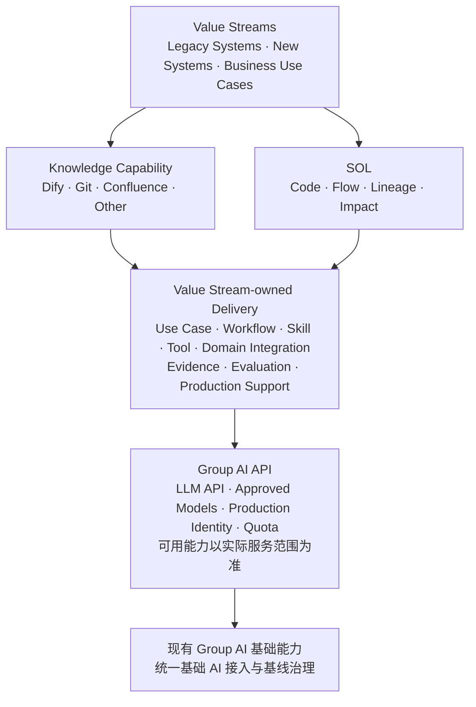

# 跨团队通用 AI 能力：共同方向与下一步

> **核心主张：**复用现有 Group AI 提供的统一基础 AI 能力和 LLM API；各 Value Stream 围绕真实业务场景设计自己的 Workflow、Skill 和 Tool，并对业务价值与生产运行负责。

> **信息来源与状态：**本材料基于本次跨团队讨论、Demo 体验及参会者提供的信息形成。现状、成熟度与规模相关陈述用于管理层方向讨论；在形成生产决策前，仍需由相应 Capability、Data 或 System Owner 结合系统记录确认。

## 一、管理摘要

相关团队与 SME 已集中体验和讨论当前的 Knowledge Base、SOL 及其他通用 AI 能力。

本次讨论形成的初步共同判断是：现有方案不应被看成互相竞争的产品。它们是在不同基础设施条件下形成的不同路径，验证了不同能力，也处于不同成熟阶段。

共同建议是：

> **不需要重新建设一套与 Group AI 重叠的基础平台，也不需要把所有工具合并成一个方案。应以 Group AI API 为共同底座，由各 Value Stream 贴合实际场景构建解决方案。**

责任边界建议明确为：

- **Group AI：**统一管理基础 AI 能力，并提供 LLM API；Production Identity、Quota、Approved Model 和治理能力以其实际服务范围为准。
- **Value Stream：**选择高价值 Use Case，设计 Workflow、Skill 和 Tool，完成领域数据与系统集成，并承担质量、成本和 Production Support 责任。
- **跨团队：**把经过真实场景验证的 Connector、Evidence、Evaluation 等组件沉淀为可复用资产，但不强制所有团队采用同一套流程或工具。

当前从实验和 PoC 进入跨团队 Production Service 的关键外部依赖是：

> **Business Sponsorship for Production-grade Group AI API Access and Required Capability Extension。**

这不是请求重新建设 Group AI，而是让具体 Use Case 获得可持续的 Production Service Account、Approved LLM、Production Quota，以及按场景所需的 Embedding、OCR、Document Understanding、合规与运行支持。

## 二、当前 Landscape

| 能力方向 | 已验证价值 | 当前适用对象 / 场景 | 主要限制与待验证项 |
|---|---|---|---|
| **AMH Knowledge Base** | Dify + GitHub Copilot 已经过上万份真实文档验证，对多数常见企业文档类型具备较好的适用性 | 当前更适合 IT 用户、已有 GitHub Copilot 许可的用户，以及大规模文档 Knowledge Retrieval | 面向 RTF / BIZ 用户时，GitHub Copilot 不是自然入口；仍需补充非 GitHub 体验、授权覆盖和业务流程集成。复杂 OCR / Layout 的质量仍需持续提升 |
| **HASE AI Knowledge Workspace** | Git Markdown + Skill + Copilot，Lightweight、Quick start、Developer-friendly，基础设施依赖较低 | 适合以 Markdown 为主、已使用 GitHub Workflow 的技术知识，以及小到中等规模的快速落地 | 当前方案只支持 Markdown；同时受 GitHub 容量与工作方式约束。普通 Git 单对象超过 100 MiB 会被阻止，仓库理想情况下应小于 1 GB，并强烈建议小于 5 GB[^github-limits]。大规模 Retrieval、权限、生命周期与索引维护仍需验证 |
| **SOL** | 提出了 Object 360、Code Explanation、Application Mapping、Flow、Lineage、Impact Analysis 和 Diagnosis 等目标能力 | 适合代码、系统关系、数据流、影响分析和运行诊断等 System Knowledge 场景 | 需要按具体 Value Stream 明确优先 Use Case、数据来源、交互入口、Evidence 和生产责任 |

[^github-limits]: [GitHub Docs — About large files on GitHub](https://docs.github.com/en/repositories/working-with-files/managing-large-files/about-large-files-on-github)：网页上传单文件上限为 25 MiB；普通 Git 对超过 100 MiB 的文件进行阻止；仓库理想情况下小于 1 GB，并强烈建议小于 5 GB。资料核对日期：2026-08-21。

## 三、这次 Alignment 得到的主要认识

### 1. 不同方案不是简单的优劣关系

AMH 和 HASE 的不同技术路径，很大程度上来自基础设施条件差异。

- AMH 已经具备 Dify 和 Digital Account，可以支持较完整的文档导入、Embedding、索引和 Retrieval。
- HASE 缺少类似基础设施，因此选择 Git Markdown、Skill 和 Copilot，是当前条件下快速启动的务实方案。

现阶段不宜要求两边强制使用同一个 Knowledge Backend。

### 2. AMH 已经验证企业 Knowledge Retrieval 的可行性，但当前入口仍偏 IT

AMH 的优势是 Dify + GitHub Copilot 已经经过大规模真实文档验证，并能够适应多数常见企业文档类型。它的重点已经不再是继续证明 RAG 是否可行，而是进一步提升：

- Document Quality
- OCR
- Complex Document Understanding
- Embedding Quality
- LLM Capability
- Production Readiness

当前适用对象主要是 IT 用户或已有 GitHub Copilot 许可的用户。若要扩展到 RTF / BIZ，需要进一步解决：

- 非 GitHub / Copilot 的用户入口
- 更适合业务用户的交互与流程
- 许可与授权覆盖
- Business context 与业务系统集成
- 面向非技术用户的 Support 与 Adoption

### 3. HASE 验证了轻量化路径的价值，但需要正视 GitHub 的规模边界

HASE 当前方案的优势包括：

- 启动快
- 基础设施依赖较低
- 与 Developer Workflow 集成自然
- Markdown 对 LLM 友好
- 适合 Git 管理的技术与工程知识

当前方案主要支持 Markdown，并天然更适合 GitHub 用户和技术知识。普通 Git 单对象超过 100 MiB 会被 GitHub 阻止；官方建议仓库保持较小，理想情况下小于 1 GB，并强烈建议小于 5 GB。这里的 5 GB 是官方建议值，不是单一硬上限。[^github-limits]

未来走向更大规模时，需要进一步验证：

- Semantic Retrieval
- Cross-document Retrieval
- Metadata
- Permission
- Document Lifecycle
- Index Maintenance
- Scalability

因此，HASE 方案并不是“不好”，而是更适合 Lightweight、Markdown-first、Developer-centric 的场景。对于大量原始企业文档、复杂格式或跨团队大规模采用，需要增加其他存储、解析、索引或访问路径。

### 4. 企业知识不只存在于文档中

除了 Dify、Git、Confluence、PDF、Requirement 和 Design Document，企业知识还存在于：

- Source Code
- Program / Job
- Call Graph
- Batch / Online Flow
- Data Lineage
- Application Dependency
- Runtime 与 Incident Information

因此，SOL 应被看成与 Document Knowledge 平行且互补的 Capability，而不是完全独立的产品。

### 5. 选择原则：按场景匹配，而不是选出唯一赢家

方案选择应至少考虑：

- **Audience：**IT / Developer，还是 RTF / BIZ；
- **Entry point：**GitHub Copilot、Web、Chat，还是业务系统内嵌；
- **Content：**Markdown、常见 Office / PDF，还是扫描件、图片和复杂布局；
- **Scale：**文档数量、单文件大小、仓库大小、并发和更新频率；
- **Control：**Permission、Evidence、Citation、Lifecycle、Audit 与 Support；
- **Speed：**快速启动，还是面向长期 Production 的完整能力。

> **AMH 更接近经过规模验证的 Knowledge Capability，HASE 更接近轻量、快速、Developer-friendly 的路径。两者服务不同约束和场景，不需要被强制收敛为一个方案。**

## 四、SDLC 全生命周期适用范围

通用 AI 与 Engineering Capability 不应只覆盖 Build、Testing 和 Deployment，而应支持从规划到维护的完整 SDLC。

这条生命周期同时适用于：

- **Legacy Systems：**通常需要更多系统发现、知识恢复、依赖识别、影响分析和现代化支持；
- **New Systems：**通常需要更强的需求协作、设计、开发、测试、发布和持续运营支持。

两类系统的技术栈和每个阶段的具体工具可以不同，但都需要相同的管理闭环。

| Phase | 主要目标 | 可关联的 AI / Common Capability |
|---|---|---|
| **1. Planning** | 明确目标、范围、需求与优先级 | Knowledge access、需求总结、Evidence、决策记录 |
| **2. Estimation** | 评估工作量、复杂度、依赖与风险 | 历史数据、SOL、依赖分析、风险识别 |
| **3. Discovery** | 理解文档、代码、系统关系与影响范围 | Knowledge Retrieval、Code Analysis、Application Mapping、Data Lineage、Change Impact |
| **4. Build** | 设计、开发和工程自动化 | Coding assistant、Skill、API、Engineering Automation |
| **5. Testing** | 测试规划、生成、执行与结果验证 | Test generation、Program Validation、Evidence、Quality Evaluation |
| **6. Deployment** | 发布、变更、上线与结果验证 | Change control、Deployment automation、Audit、Health Monitoring |
| **7. Maintenance** | 监控、问题诊断、修复与知识更新 | Incident Diagnosis、Runtime Evidence、Knowledge update、Impact Analysis |

核心原则是：

> **Group AI 提供共同的基础 AI 与 API；每个 Value Stream 根据自身系统、流程和目标用户，在各 SDLC 阶段设计相应 Workflow、Skill 与 Tool。**

## 五、建议的共同方向

建议采用“Group AI 统一基础能力、Value Stream 自主场景化”的联邦式方向：

- 复用现有 Group AI，而不是另建一套重叠的 AI Foundation；
- 通过 Group AI API 使用 LLM，并逐步申请生产所需的模型、身份和配额；
- 允许现有 Knowledge 和 SOL 能力继续演进；
- 不要求所有团队迁移到同一个 Knowledge Backend；
- 不要求所有 Capability 使用同一个 UI；
- 将 Dify、Git Markdown、Confluence 和未来其他来源视为不同 Provider；
- 由各 Value Stream 根据真实 Use Case 定义 Workflow、Skill、Tool 和领域集成；
- 把被多个场景证明有价值的 Provider、Evidence、Evaluation 等组件逐步沉淀为共享资产；
- 覆盖 Planning 到 Maintenance 的完整 SDLC，同时服务旧系统和新系统；
- 从已验证的 Use Case 增量建设，避免 Big Bang。

### Group AI 统一提供或管理

- LLM API 与基础模型接入
- Approved Model Access
- Production Service Identity 与 Quota（需按实际服务范围确认）
- 基线 Governance、Audit、Usage 与 Cost 能力（需按实际服务范围确认）

### 各 Value Stream 自主负责

- 业务 Use Case 与成功指标
- Workflow、Skill 和 Tool
- Knowledge / System Provider 集成
- 领域 Authorization、Evidence 与 Citation
- Quality Evaluation 与 Production Readiness
- 运行支持、成本与业务结果

### 不应强制统一

- Knowledge Backend
- Source of Truth
- Provider 内部的 Retrieval 实现
- UI
- 团队特定的 Workflow、Skill、Tool 与业务流程
- 领域专属的 SOL 或 Engineering Capability

可以用一句话概括：

> **Group AI 统一基础 AI 能力与 API；Value Stream 决定怎样把这些能力组合成真正产生业务价值的 Workflow 和 Tool。**

## 六、建议的整体结构

核心信息是：

> **Group AI 是统一基础能力提供方；Value Stream 是场景、Workflow、Tool 和业务结果的 Owner。**

## 七、当前主要 Gap 与 Blocker

目前技术方向已经足够清晰，可以进入下一阶段验证。

Group AI 已经提供基础能力，当前问题不是“有没有统一平台”，而是如何让具体 Use Case 从基础 API 走向可持续的 Production Service。最重要的外部依赖是：

> **缺少面向具体 Value Stream Use Case 的 Production-grade Group AI API Access、Service Account、Quota 和所需能力扩展。**

个人 Ideation 环境主要适合个人实验、Prototype 和小规模 PoC。约 $50 的个人额度无法为 Value Stream 的共享 Production Service 稳定提供：

- 可持续的服务身份
- 可规划的生产配额
- Approved LLM 与 Embedding
- OCR 与 Document Understanding
- 成本归属与预算管理
- 凭证生命周期管理
- 合规审批
- Production Support 与事故责任

AMH 目前可以通过已有 Digital Account 支持部分能力；HASE 缺少类似条件。这也是双方技术路径不同的重要原因之一。下一步应优先确认 Group AI 的生产 API、账号、模型与配额边界，再识别确实需要补充的 Embedding、OCR 或 Document Understanding 能力。

需要强调的是：

> **Group AI Production API Access 是共同前提；Value Stream 对场景化交付负责，才是价值落地的关键。**

并行还需要解决：

- 明确的生产 Use Case
- Business Owner 与 Value Stream Owner
- Workflow / Tool Owner
- Domain Identity、ACL、Evidence 与 Citation
- 质量评测
- 成本与容量预测
- Production Support Model

## 八、下一阶段的建议行动

### 1. 明确优先 Use Case

选择具有明确业务价值的生产候选场景，并为每个场景确认：

- Business Sponsor
- Data / System Owner
- 目标用户
- 成功指标
- 生产责任

并由对应 Value Stream 先定义该场景需要的 Workflow、Skill、Tool、数据源与系统集成，而不是等待一个中央团队给出完整解决方案。

### 2. 确认 Group AI API 与生产接入边界

优先定义：

- 可用 LLM API 与 Approved Model
- Production Service Account 与 Identity
- Quota、Cost、Audit 与 Support Model
- Embedding、OCR、Document Understanding 的可用范围或扩展路径
- API 的 Health、Error 与 Usage reporting

并由 AMH Dify 与 HASE GitHub-based Knowledge Base 等真实场景验证 API 是否满足生产需要。

### 3. 由 Value Stream 构建场景化 Workflow 与 Tool

每个试点 Value Stream 负责：

- 选择最有价值的用户旅程和 SDLC Phase
- 设计 Workflow、Skill、Tool 与 Human-in-the-loop
- 接入本地 Knowledge / System Provider
- 实现领域 Authorization、Evidence 与 Citation
- 明确质量、成本、SLO 与 Production Support

### 4. 把验证有效的组件沉淀为共享资产

优先复用而不是预先统一，例如：

- Provider / Connector pattern
- Evidence / Citation structure
- Evaluation dataset 与 quality gate
- Usage / Cost / Health integration
- Common Skill / API wrapper

### 5. 建立共同质量标准

建立代表性评测集，覆盖：

- 普通文档
- Scanned PDF
- Table
- PowerPoint
- Screenshot / Image
- Cross-document questions
- Citation correctness
- Permission negative tests

### 6. 明确 Operating Model

进一步确认：

- Group AI API / Service Owner
- Value Stream Product Owner
- Workflow / Tool Owner
- Data / System / Provider Owner
- Support 与 Incident responsibility
- 跨团队资源投入

## 九、需要管理层支持的三件事

### 1. Business Sponsorship for Production-grade Group AI API Access

支持相关 Use Case 从 Ideation / PoC 进入 Production。这不是重新建设 Group AI，而是获得：

- Production Service Account
- Approved LLM
- Embedding Model
- OCR / Document Understanding
- Production Quota
- 合规与运行审批

### 2. 确认 Group AI 与 Value Stream 的责任边界

确认 Group AI 负责统一基础 AI 能力与 API；各 Value Stream 负责场景、Workflow、Skill、Tool 和业务结果。跨团队组件在实际验证后复用，而不是预先强制统一。

### 3. 确认跨团队授权、Owner 与资源

为初期验证明确：

- Accountable Owner
- Engineering Capacity
- Funding / Cost Ownership
- Production Support Responsibility

## 十、建议管理层本次确认的事项

本次不需要管理层决定：

- 最终使用 Dify、GitHub 还是其他技术；
- 所有团队未来必须使用哪个 Backend；
- 平台最终叫什么；
- 完整的长期架构。

建议本次确认：

1. 是否认可“Group AI 统一基础能力、Value Stream 自主场景化”的方向；
2. 是否支持 Production-grade Group AI API Access 与所需能力扩展；
3. 是否批准由一至两个 Value Stream 开展聚焦的真实 Use Case 验证；
4. 是否明确相应 Owner、资源和支持责任。

## 十一、管理层核心结论

1. **相关团队和方案已经完成第一轮集中 Alignment，当前 Landscape 已基本看清。**
2. **AMH、HASE 和 SOL 是互补能力，不应被简单看成竞争方案。**
3. **现有 Group AI 应作为统一基础能力和 LLM API 提供方，无需重复建设。**
4. **Planning、Estimation、Discovery、Build、Testing、Deployment 和 Maintenance 同时适用于旧系统和新系统。**
5. **每个 Value Stream 需要贴合自己的实际场景设计 Workflow、Skill 和 Tool，并对价值与生产运行负责。**
6. **Business Sponsorship for Production-grade Group AI API Access 是当前最关键的外部支持请求。**

## 结语

> **现在不是请求管理层选择一个最终工具，也不是重新建设 Group AI。需要确认的是：以 Group AI API 为共同底座，由各 Value Stream 围绕真实业务场景构建 Workflow、Skill 和 Tool，并获得进入 Production 所需的账号、模型、配额和支持。**
