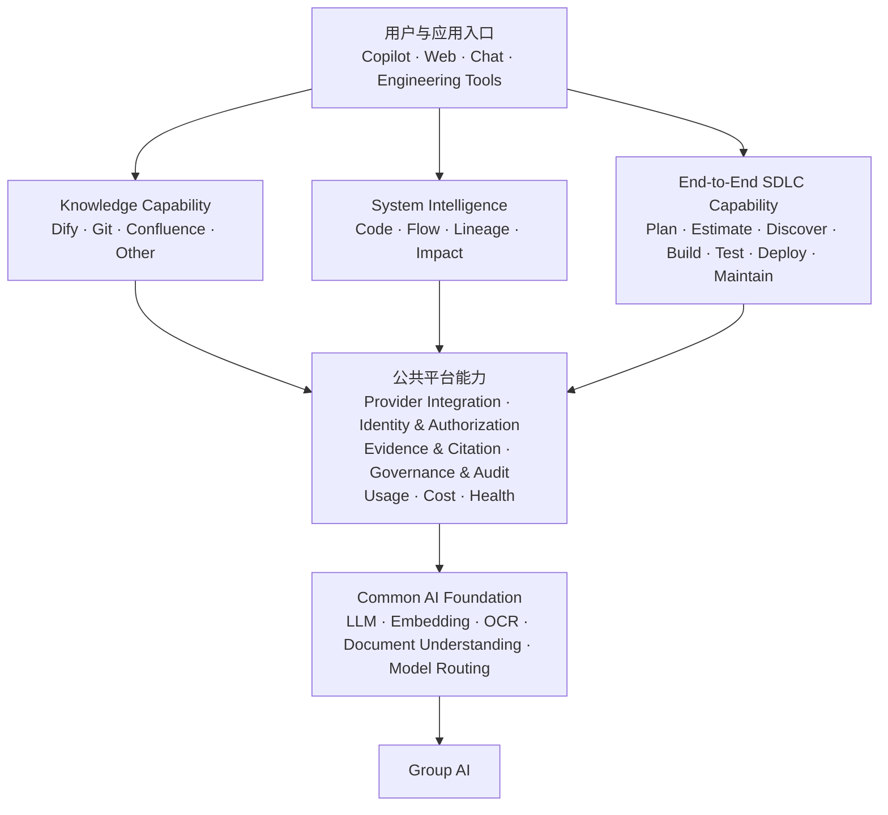

# 跨团队通用 AI 能力：共同方向与下一步

> **核心主张：**统一公共基础能力，不强制统一 Backend、Provider 或 UI。让不同 Capability 独立演进，同时共享 Production AI、安全、Evidence 与治理基础。

> **信息来源与状态：**本材料基于本次跨团队讨论、Demo 体验及参会者提供的信息形成。现状、成熟度与规模相关陈述用于管理层方向讨论；在形成生产决策前，仍需由相应 Capability、Data 或 System Owner 结合系统记录确认。

## 一、管理摘要

相关团队与 SME 已集中体验和讨论当前的 Knowledge Base、System Intelligence 及其他通用 AI 能力。

本次讨论形成的初步共同判断是：现有方案不应被看成互相竞争的产品。它们是在不同基础设施条件下形成的不同路径，验证了不同能力，也处于不同成熟阶段。

共同建议是：

> **不需要把所有工具合并成一个方案，需要的是管理共享能力的公共平台与 Common AI Foundation。**

短期内，各方案可以继续独立演进。同时，应逐步定义并验证最小公共能力，包括：

- Production-grade AI access
- Identity 与 Authorization
- Provider / Connector 标准
- Evidence、Citation 与 Provenance
- Governance 与 Audit
- Usage、Cost 与 Health Management

当前从实验和 PoC 进入跨团队 Production Service 的关键外部依赖是：

> **Business Sponsorship for Group AI Production Access。**

这不仅意味着获得更强的 LLM，还包括 Production Service Account、Embedding、OCR、Document Understanding、Production Quota，以及相应的合规与运行支持。

## 二、当前 Landscape

| 能力方向 | 当前已经验证的内容 | 建议定位 |
|---|---|---|
| **AMH Knowledge Base** | 基于 Dify 完成文档导入、解析、索引和 Retrieval，并通过 GitHub Copilot 提供 Chat/Agent 体验；Dify 中已有上万份真实文档 | 已经过较大规模真实场景验证的 Knowledge Capability |
| **HASE GitHub-based Knowledge Base** | 通过文档转 Markdown、GitHub Repository、Search Skill 和 Copilot 实现轻量化知识访问 | 在现有基础设施约束下务实、轻量、Developer-friendly 的方案；规模化与 Production Readiness 仍需验证 |
| **System Intelligence** | 提出了 Object 360、Code Explanation、Application Mapping、Flow、Lineage、Impact Analysis 和 Diagnosis 等目标能力 | 重要的 System Intelligence Capability Vision，可与文档知识互补 |
| **End-to-End SDLC Capability** | 从 Planning、Estimation、Discovery 到 Build、Testing、Deployment 和 Maintenance 的完整生命周期 | 旧系统和新系统共同需要、可复用同一 AI Foundation 的工程能力方向 |

## 三、这次 Alignment 得到的主要认识

### 1. 不同方案不是简单的优劣关系

AMH 和 HASE 的不同技术路径，很大程度上来自基础设施条件差异。

- AMH 已经具备 Dify 和 Digital Account，可以支持较完整的文档导入、Embedding、索引和 Retrieval。
- HASE 缺少类似基础设施，因此选择 Git Markdown、Skill 和 Copilot，是当前条件下快速启动的务实方案。

现阶段不宜要求两边强制使用同一个 Knowledge Backend。

### 2. AMH 已经验证企业 Knowledge Retrieval 的可行性

AMH 的重点已经不再是继续证明 RAG 是否可行，而是进一步提升：

- Document Quality
- OCR
- Complex Document Understanding
- Embedding Quality
- LLM Capability
- Production Readiness

### 3. HASE 验证了轻量化路径的价值

HASE 当前方案的优势包括：

- 启动快
- 基础设施依赖较低
- 与 Developer Workflow 集成自然
- Markdown 对 LLM 友好
- 适合 Git 管理的技术与工程知识

未来走向更大规模时，需要进一步验证：

- Semantic Retrieval
- Cross-document Retrieval
- Metadata
- Permission
- Document Lifecycle
- Index Maintenance
- Scalability

### 4. 企业知识不只存在于文档中

除了 Dify、Git、Confluence、PDF、Requirement 和 Design Document，企业知识还存在于：

- Source Code
- Program / Job
- Call Graph
- Batch / Online Flow
- Data Lineage
- Application Dependency
- Runtime 与 Incident Information

因此，System Intelligence 应被看成与 Document Knowledge 平行且互补的 Capability，而不是完全独立的产品。

## 四、SDLC 全生命周期适用范围

通用 AI 与 Engineering Capability 不应只覆盖 Build、Testing 和 Deployment，而应支持从规划到维护的完整 SDLC。

这条生命周期同时适用于：

- **Legacy Systems：**通常需要更多系统发现、知识恢复、依赖识别、影响分析和现代化支持；
- **New Systems：**通常需要更强的需求协作、设计、开发、测试、发布和持续运营支持。

两类系统的技术栈和每个阶段的具体工具可以不同，但都需要相同的管理闭环。

| Phase | 主要目标 | 可关联的 AI / Common Capability |
|---|---|---|
| **1. Planning** | 明确目标、范围、需求与优先级 | Knowledge access、需求总结、Evidence、决策记录 |
| **2. Estimation** | 评估工作量、复杂度、依赖与风险 | 历史数据、System Intelligence、依赖分析、风险识别 |
| **3. Discovery** | 理解文档、代码、系统关系与影响范围 | Knowledge Retrieval、Code Analysis、Application Mapping、Data Lineage、Change Impact |
| **4. Build** | 设计、开发和工程自动化 | Coding assistant、Skill、API、Engineering Automation |
| **5. Testing** | 测试规划、生成、执行与结果验证 | Test generation、Program Validation、Evidence、Quality Evaluation |
| **6. Deployment** | 发布、变更、上线与结果验证 | Change control、Deployment automation、Audit、Health Monitoring |
| **7. Maintenance** | 监控、问题诊断、修复与知识更新 | Incident Diagnosis、Runtime Evidence、Knowledge update、Impact Analysis |

核心原则是：

> **公共平台复用各阶段共同依赖的 AI、安全、Evidence、治理与运行能力；阶段专属工具和流程继续独立演进。**

## 五、建议的共同方向

建议采用联邦式、Provider-neutral 的方向：

- 允许现有 Knowledge 和 System Intelligence 能力继续演进；
- 不要求所有团队迁移到同一个 Knowledge Backend；
- 不要求所有 Capability 使用同一个 UI；
- 将 Dify、Git Markdown、Confluence 和未来其他来源视为不同 Provider；
- 定义最小统一的 Provider、Identity、Evidence 和 Citation 接口；
- 复用公共的 Production AI、安全、治理和运行基础能力；
- 覆盖 Planning 到 Maintenance 的完整 SDLC，同时服务旧系统和新系统；
- 从已验证的 Use Case 增量建设，避免 Big Bang。

### 应该共享

- Production AI Service Identity
- Approved Model Access
- Identity 与 Authorization
- Evidence、Citation 与 Provenance
- Governance 与 Audit
- Provider Integration
- Usage、Cost 与 Health Monitoring
- Quality 与 Production Readiness 标准

### 不应强制统一

- Knowledge Backend
- Source of Truth
- Provider 内部的 Retrieval 实现
- UI
- 团队特定的业务流程
- 领域专属的 System Intelligence 或 Engineering Capability

可以用一句话概括：

> **公共平台应该统一 Capability 如何被访问、治理和运行，而不是规定所有知识必须存在哪里。**

## 六、建议的整体结构

核心信息是：

> **不同 Capability 和 Provider 可以独立演进，但共享底层的 Production AI、安全、Evidence 与治理能力。**

## 七、当前主要 Gap 与 Blocker

目前技术方向已经足够清晰，可以进入下一阶段验证。

但从 PoC 进入跨团队 Production Service，当前最重要的外部依赖是：

> **缺少 Production-grade Group AI Capability 和可供共享服务使用的 Service Account。**

个人 Ideation 环境主要适合个人实验、Prototype 和小规模 PoC。它无法为共享 Production Service 稳定提供：

- 可持续的服务身份
- 可规划的生产配额
- Approved LLM 与 Embedding
- OCR 与 Document Understanding
- 成本归属与预算管理
- 凭证生命周期管理
- 合规审批
- Production Support 与事故责任

AMH 目前可以通过已有 Digital Account 支持部分能力；HASE 缺少类似条件。这也是双方技术路径不同的重要原因之一。

需要强调的是：

> **Group AI Production Access 是关键前提，但不是唯一成功条件。**

并行还需要解决：

- 明确的生产 Use Case
- Business Owner
- Platform / Service Owner
- Identity 与 ACL
- 质量评测
- 成本与容量预测
- Production Support Model

## 八、下一阶段的建议行动

### 1. 明确优先 Use Case

选择具有明确业务价值的生产候选场景，并为每个场景确认：

- Business Sponsor
- Data / System Owner
- 目标用户
- 成功指标
- 生产责任

### 2. 定义最小公共接口

优先定义：

- Provider capability contract
- Identity / Authorization context
- Evidence / Citation structure
- Health、Error 与 Usage reporting
- Common API / Skill boundary

并通过 AMH Dify 与 HASE GitHub-based Knowledge Base 验证 Provider abstraction。

### 3. 推进 Production Enablement

准备 Group AI Production Access request，明确：

- Production Service Account
- LLM、Embedding、OCR 和 Document Understanding 需求
- 预估用量与 Production Quota
- 数据分类与合规范围
- 成本归属
- SLO 与 Support Model

### 4. 建立共同质量标准

建立代表性评测集，覆盖：

- 普通文档
- Scanned PDF
- Table
- PowerPoint
- Screenshot / Image
- Cross-document questions
- Citation correctness
- Permission negative tests

### 5. 明确 Operating Model

进一步确认：

- Product Owner
- Technical Owner
- Service Owner
- Provider Owner
- Support 与 Incident responsibility
- 跨团队资源投入

## 九、需要管理层支持的三件事

### 1. Business Sponsorship for Group AI Production Access

支持相关 Use Case 从 Ideation / PoC 进入 Production，包括：

- Production Service Account
- Approved LLM
- Embedding Model
- OCR / Document Understanding
- Production Quota
- 合规与运行审批

### 2. 认可联邦式 Common Platform 方向

确认现阶段的目标是复用公共基础能力，而不是要求团队立即迁移到一个 Backend、Provider 或 UI。

### 3. 确认跨团队授权、Owner 与资源

为初期验证明确：

- Accountable Owner
- Engineering Capacity
- Funding / Cost Ownership
- Production Support Responsibility

## 十、建议管理层本次确认的事项

本次不需要管理层决定：

- 最终使用 Dify、GitHub 还是其他技术；
- 所有团队未来必须使用哪个 Backend；
- 平台最终叫什么；
- 完整的长期架构。

建议本次确认：

1. 是否认可联邦式 Common Platform 方向；
2. 是否支持 Group AI Production Access；
3. 是否批准一个聚焦的跨 Provider 验证；
4. 是否明确相应 Owner、资源和支持责任。

## 十一、管理层核心结论

1. **相关团队和方案已经完成第一轮集中 Alignment，当前 Landscape 已基本看清。**
2. **AMH、HASE 和 System Intelligence 是互补能力，不应被简单看成竞争方案。**
3. **应复用公共基础能力，但不应过早强制统一 Backend、Provider 或 UI。**
4. **Planning、Estimation、Discovery、Build、Testing、Deployment 和 Maintenance 同时适用于旧系统和新系统。**
5. **下一阶段应进行聚焦的跨 Provider、跨 SDLC 阶段验证，而不是启动 Big Bang 平台项目。**
6. **Business Sponsorship for Group AI Production Access 是当前最关键的外部支持请求。**

## 结语

> **现在不是请求管理层选择一个最终技术方案，而是希望管理层认可共同方向，支持 Group AI Production Access，并授权一个有明确 Owner 和成功标准的下一阶段验证。现有能力可以继续推进，公共基础能力则通过实际 Use Case 逐步沉淀。**
